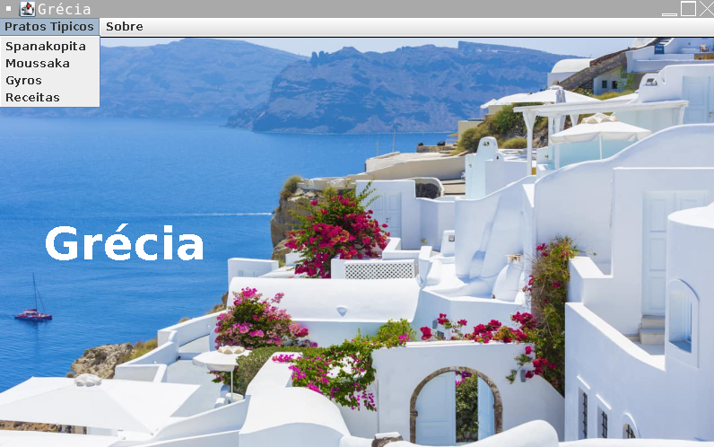
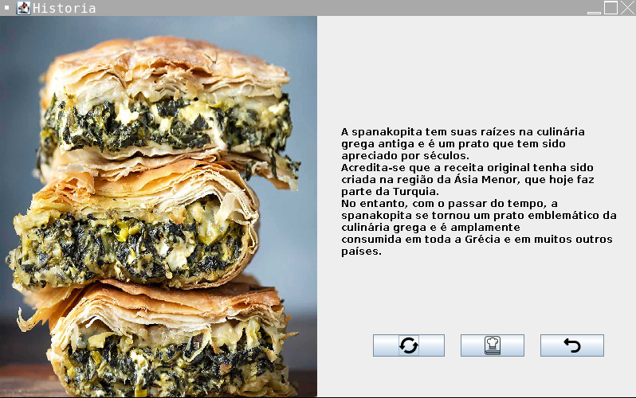
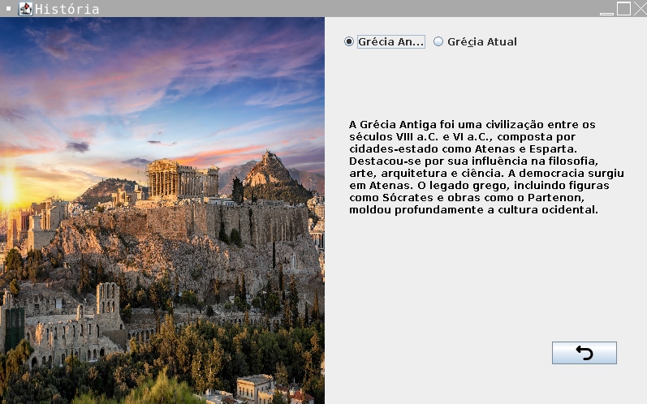
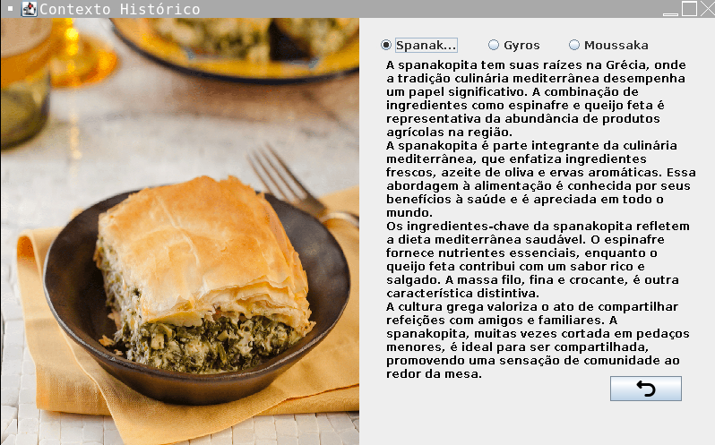

# Interface Gráfica de História da Grécia Antiga e Comidas Típicas

## Descrição do Projeto

Este projeto Java implementa uma interface gráfica que oferece uma experiência educativa e cultural. A interface apresenta um campo dedicado à história da Grécia Antiga, com informações detalhadas sobre aspectos importantes dessa civilização, e um painel separado para exibir três comidas típicas da Grécia: **Gyros**, **Moussaka** e **Spanakopita**.

## Funcionalidades

- **História da Grécia Antiga:** Um campo de texto que exibe uma breve história sobre a Grécia Antiga, destacando fatos históricos, cultura e influências.
- **Comidas Típicas:** Um painel dedicado a três pratos tradicionais da Grécia, com uma breve descrição de cada um:
  - **Gyros:** Sanduíche grego com carne, vegetais e molho tzatziki.
  - **Moussaka:** Prato de camadas de berinjela, carne moída e molho béchamel.
  - **Spanakopita:** Torta folhada recheada com espinafre e queijo feta.

## Tecnologias Utilizadas

- **Java Swing**: Para a criação da interface gráfica.
- **Java AWT**: Para a manipulação de componentes gráficos.
- **JDK 11**: Versão do Java utilizada no desenvolvimento do projeto.

## Como Executar o Projeto

1. Clone este repositório: `git clone https://github.com/Vilelajlr/Trabalho-JavaPOO.git`
2. Importe o projeto em sua IDE de preferência (Eclipse, IntelliJ, etc.).
3. Execute o arquivo principal (`Main.java`) para iniciar a interface gráfica.

## Capturas de Tela

## Autor

Desenvolvido por **José Leandro Vilela**.

## Licença

Este projeto está licenciado sob a [MIT License](LICENSE).
